# Notas sobre la geometría de los mínimos cuadrados

1. Siempre me intrigó que la primera opción para los modelos de regresión fuese minimizar los errores cuadráticos y no los absolutos. ¿Por qué la preferencia? ¿No parece más lógico usar los errores absolutos?

$Y = X\beta + \epsilon$ con $\beta=(X^tX)^{-1}X^tY$

2. Aunque ambas alternativas son válidas hay motivos para preferir la primera (salvo en ciertos casos). Pero más que en aspectos teóricos profundos quiero hacer foco en algo que siempre me fascinó: la **intuición** y las **estructuras geométricas** detrás de cada metodología

3. Elegir la función que minimizaremos es más que una cuestión operativa: en realidad, estamos adoptando una estructura para el espacio con el que modelizaremos nuestros datos e inferencias; estructura que definirá la forma de medir largos, distancias y ángulos entre vectores

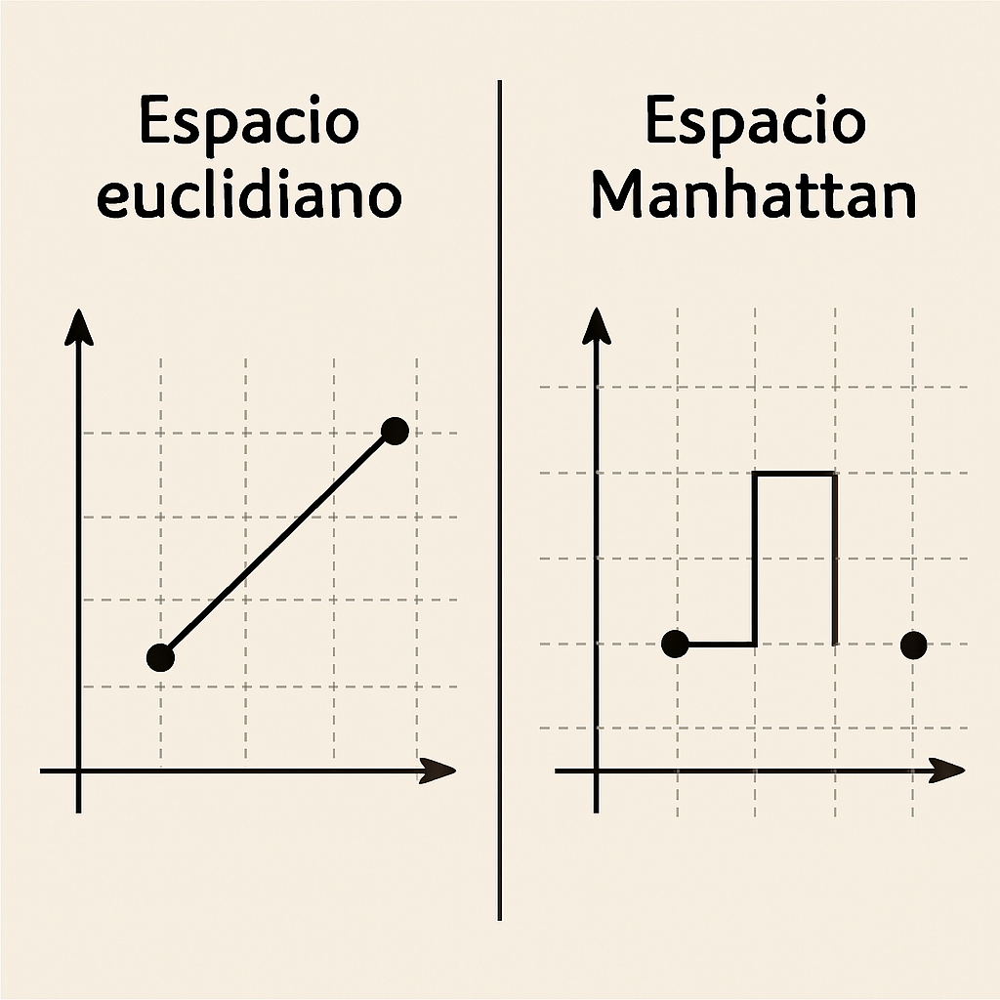

4. Y si bien, como dijimos, ambas metodologías son válidas, veremos que la estructura supuesta por la minimización de los errores cuadráticos se adapta de manera más "armónica" a la modelización estadística que la de los errores absolutos

5. Adelantemos el final: elegir *mínimos cuadrados ordinarios* (MCO) es 
tomar la geometría de los **espacios euclidianos**, mientras que el 
método de *mínimas desviaciones absolutas* (MAD) se asocia a una geometría más "rara" (**la geometría "del taxista"**) ¿Qué es cada cosa?

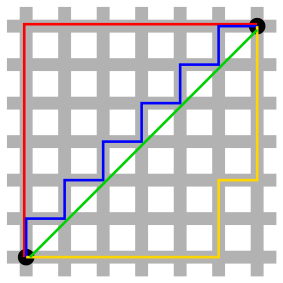

6. Un **espacio euclidiano** es un espacio vectorial dotado de un *producto interno*, del cual se deriva una *norma* (como medimos el largo de los vectores) y de ésta última una *métrica* (como medimos distancias). Estos elementos permiten también definir la noción fundamental de *ángulo*

**Espacios euclidianos de *n* dimensiones**

**Producto interior**

$\langle x,y \rangle=\sum_1^{n}{x_iy_i}$

**Norma** inducida por el producto interior

$\|x\| = \langle x,x \rangle^{1/2}=(\sum_1^{n}{x_i^2})^{1/2}$

**Ángulo**

$\cos(\theta_{xy}) = \frac{\langle x,y \rangle}{\|\mathbf{x}\|\|\mathbf{y}\|}$

7. En los espacios euclidianos se cumple el teorema de Pitágoras.
La distancia entre dos vectores se define como la norma de su diferencia. Esto es una forma difícil de decir que es **la distancia que usamos todos los días** 

$d_{eu}=\lvert \lvert{x-y}\lvert \lvert= 
\langle x-y,x-y \rangle^{1/2}=(\sum_1^{n}{(x_i-y_i)^2})^{1/2}$

8. Con esta métrica, puntos equidistantes a otro forman círculos concéntricos y su distancia se calcula como la suma cuadrática de la diferencia de sus componentes (Pitágoras!) 

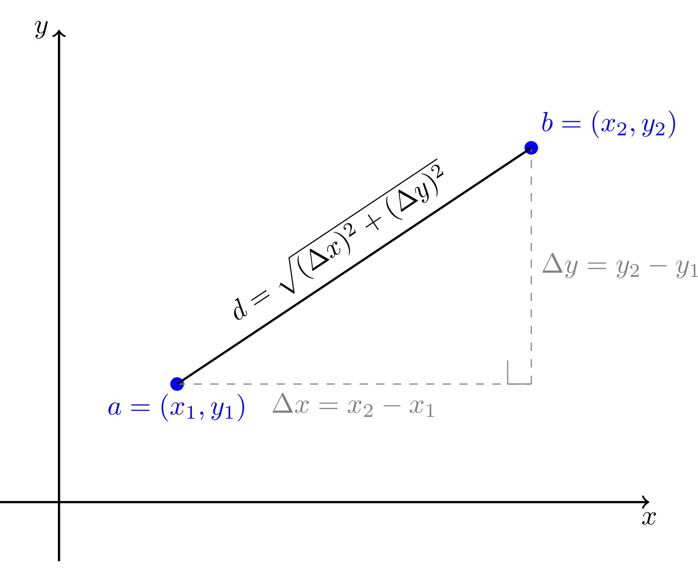
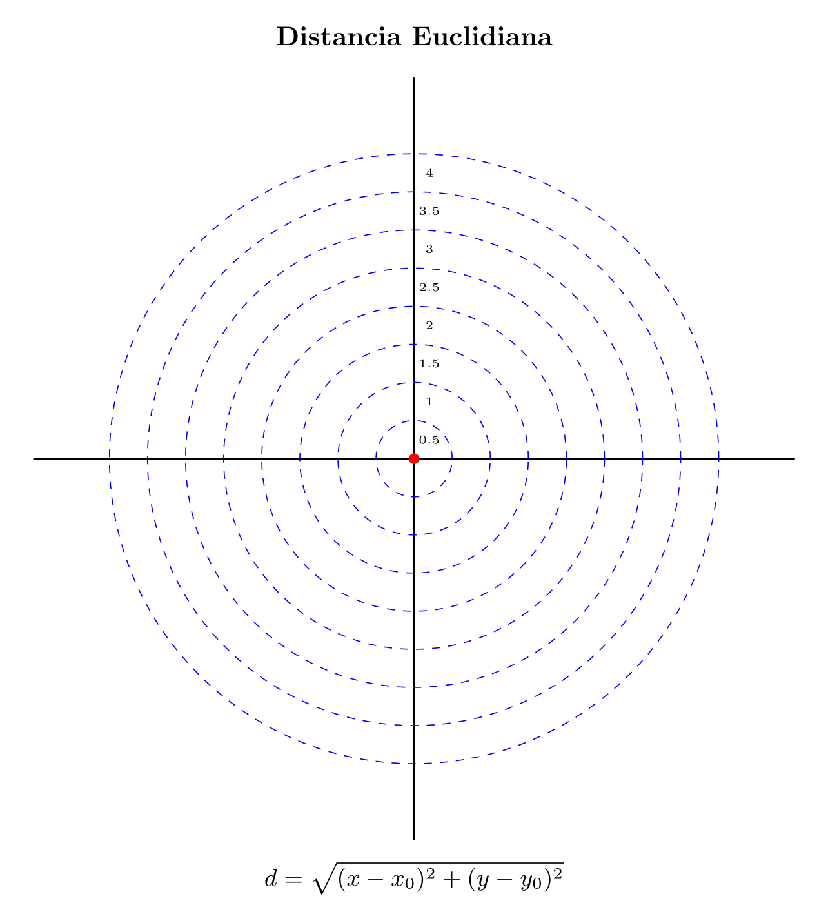

9. En cambio la distancia manhattan (asociada, como adelantamos, al MAD) es la suma de la diferencia absoluta de los componentes. En este caso los puntos equidistantes forman rombos (rarísimo!). Y eso cambia radicalmente la geometría del espacio.

$d_{man}=\lvert \lvert{x-y}\lvert \lvert= 
\sum_1^{n}{|x_i-y_i|}$

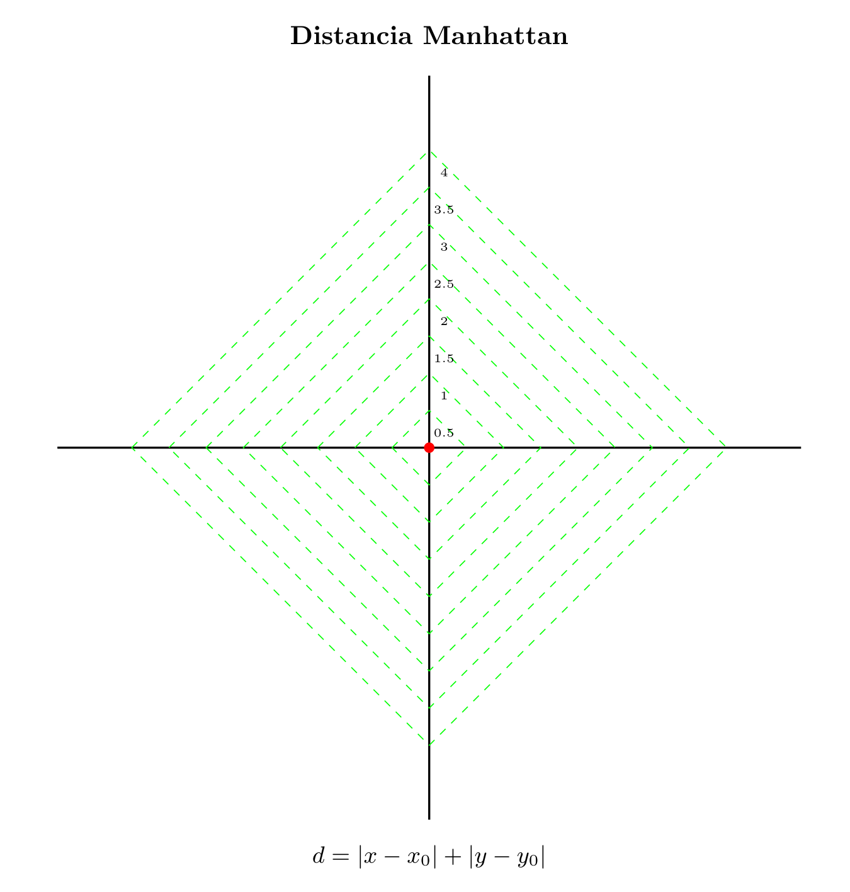

10. Ahora comparemos como es en cada caso la distancia entre un punto Y y una recta. Parece un trabalenguas pero es fácil: corresponde a la distancia del punto sobre la recta más cercano a Y. Esto equivale a buscar un beta que minimice dicha distancia (que varía con cada métrica)

Caso **euclidiano**

$argmin \space \beta: \space \lvert \lvert{x\beta-y}\lvert \lvert=
(\sum_1^{n}{(x_i\beta-y_i)^2})^{1/2}$

Caso **manhattan**

$argmin \space \beta: \space \lvert \lvert{x\beta-y}\lvert \lvert= 
\sum_1^{n}{|x_i\beta-y_i|}$

11. Tomemos nota para más adelante: minimizar la raíz de una función positiva es lo mismo que minimizar directamente la función (porque la raíz se vuelve monótona creciente). En el caso euclidiano el problema planteado es equivalente a minimizar las diferencias cuadráticas

$argmin \space \beta: \space \lvert \lvert{x\beta-y}\lvert \lvert=
(\sum_1^{n}{(x_i\beta-y_i)^2})^{1/2}$ 

es equivalente a 

$argmin \space \beta: \space \lvert \lvert{x\beta-y}\lvert \lvert=
\sum_1^{n}{(x_i\beta-y_i)^2}$ 

12. Como vemos, los resultados de esta minimización difieren con cada métrica (tanto en el punto encontrado como en su distancia). Con la euclidiana el punto más cercano (Pe) está sobre el **círculo tangente**, mientras que con manhattan (Pm), está sobre el **rombo tangente** 

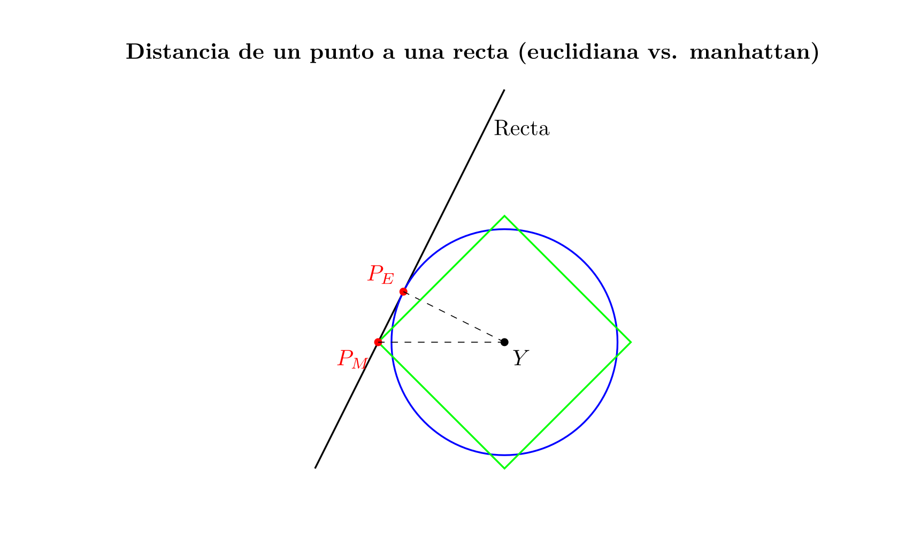

12. A la luz de la forma en que calculamos las distancias que nos separan de los objetos en el día a día, el punto Pe luce más "natural": la métrica **euclidiana** es la que usamos intuitivamente. Notablemente, en este caso el segmento entre Y y Pe es *perpendicular* a la recta

13. Por eso Pe se llama "proyección ortogonal" del vector Y sobre la recta. Noten que la perpendicularidad demanda una idea de "ángulo", que se define a partir de dos estructuras que mencionamos: el producto interior y la norma

Producto interior de A con B

$\mathbf{A} \cdot \mathbf{B} = \|\mathbf{A}\|\|\mathbf{B}\|\cos(\theta)$

es decir

$\cos(\theta) = \frac{\mathbf{A} \cdot \mathbf{B}}{\|\mathbf{A}\|\|\mathbf{B}\|}$

14. A nuestros fines lo importante del concepto de ángulo es que permite medir cuán "paralelos" son dos vectores. Cuando el ángulo es cero un vector se puede escribir como múltiplo exacto del otro. Cuando el ángulo crece los vectores son cada vez "menos proporcionales"

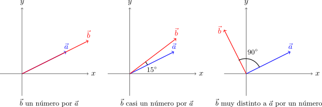

15. En un espacio euclidiano (con variables centradas) la correlación lineal entre dos vectores de datos es simplemente el coseno del ángulo que forman(!). Dos vectores perpendiculares son (lineamente) todo lo diferentes que pueden ser (y cuando es así, se anula el producto interior)

$\cos(\pi/2) = 0 =  \frac{\mathbf{A} \cdot \mathbf{B}}{\|\mathbf{A}\|\|\mathbf{B}\|} \implies \mathbf{A}\cdot\mathbf{B}\ = 0$ (con $\|\mathbf{A}\| \space y \space \|\mathbf{B}\| > 0 $)

16. Aquí menciono un punto crucial cuya demostración escapa a este hilo: una gran desventaja de la distancia manhattan es que no es posible encuadrarla en una estructura geométrica semejante. Aunque es posible definir una norma, no podemos definir un producto interior

17. Por lo que no tenemos ángulos ni proyecciones ortogonales, fundamentales a la hora de definir (entre otros) el concepto de correlación. Peor aún, en espacios con esta métrica, los puntos de mínima distancia pueden no ser únicos, por ejemplo: 

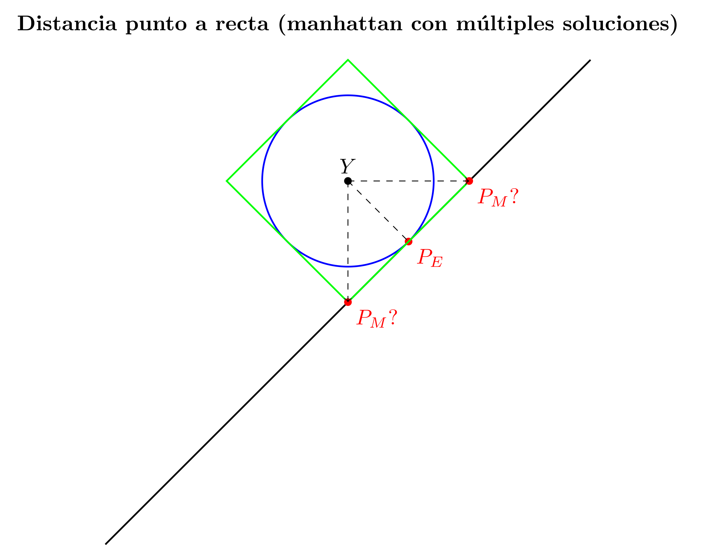

18. Pero qué tiene que ver todo esto con la regresión lineal!? Un montón! Mostraremos visualmente que estimar linealmente equivale a encontrar un punto de la recta generada por el vector de variables independientes más cercano al punto que representa a las variables dependientes

19. Recapitulemos. El (MCO) minimiza los errores cuadráticos. El método de Mínimas Desviaciones Absolutas (MAD) minimiza los errores absolutos. 

**MCO:** minimiza la suma de *errores cuadráticos*

$y = \hat{y} + \hat{e} = x\beta + \hat{e}$ con un $\beta$ que minimiza  

$argmin \space\beta\space \lvert\lvert\hat{e}\rvert\rvert_{mco}=\sum_{i=1}^{n}\hat{e_i}^2=\sum_{i=1}^{n}(y_i-\hat{y}_i)^2=\sum_{i=1}^{n}(x_i\beta-y_i)^2$

**MAD:** minimiza la suma de *desviaciones absolutas*

 $argmin \space\beta\space\lvert\lvert\hat{e}\rvert\rvert_{mad}=\sum_{i=1}^{n}\lvert\hat{e_i}\rvert=\sum_{i=1}^{n}\lvert y_i-\hat{y}_i\rvert=\sum_{i=1}^{n}\lvert x_i\beta-y_i\rvert$

20. La equivalencia formal con el ejercicio que planteamos es evidente (salvando el detalle del que tomamos nota para el caso euclidiano sobre minimizar la raíz una función positiva). Pero visualizar esta equivalencia es mucho más interesante que plasmarla formalmente.

21. A este fin consideremos la regresión de una sola variable (y) con un solo regresor (x), sin intercepto. Y consideremos sólo dos observaciones: para x=1 se observó y=2 y para x=2, y=5

$y=\beta x + e$ 

$y=(y_1, y_2)=(2,5)$ 

$x=(x_1, x_2)=(1,2)$

22. Lo bueno de este ejemplo de juguete es que podemos representarlo en 2D: en las abcisas ubicaremos la primera observación y en las ordenadas la segunda. Entonces y es el vector (2,5), y beta * x genera una recta desde el origen que pasa por x=(1,2).

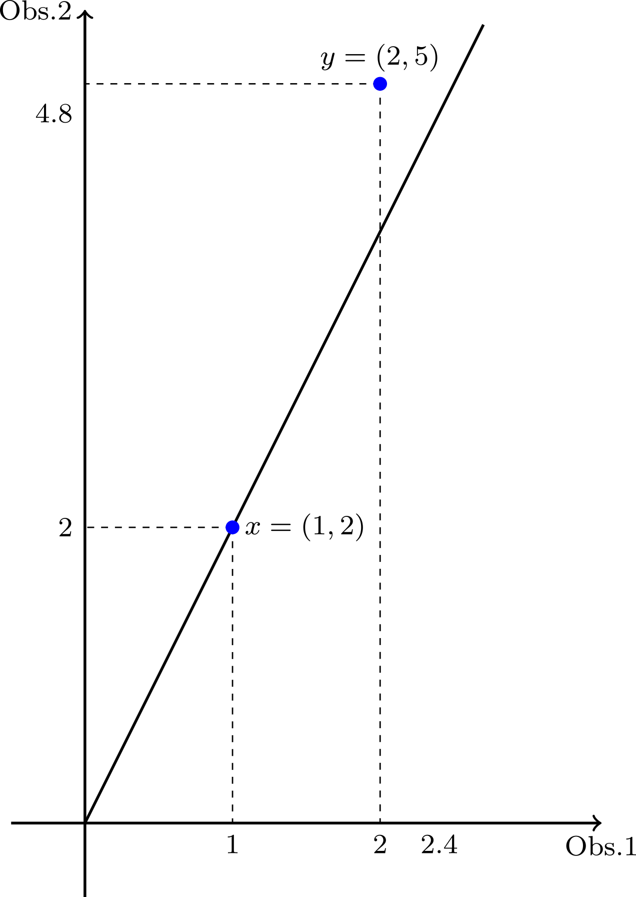

23. La recta es el espacio que representa los puntos "barridos" por el vector x con cada valor de beta. Y lo que queremos al estimar es, justamente, un beta que multiplizado por x = (1,2) esté lo más cerca posible de y = (2,5). ¡Minimizar la distancia entre el punto y la recta!

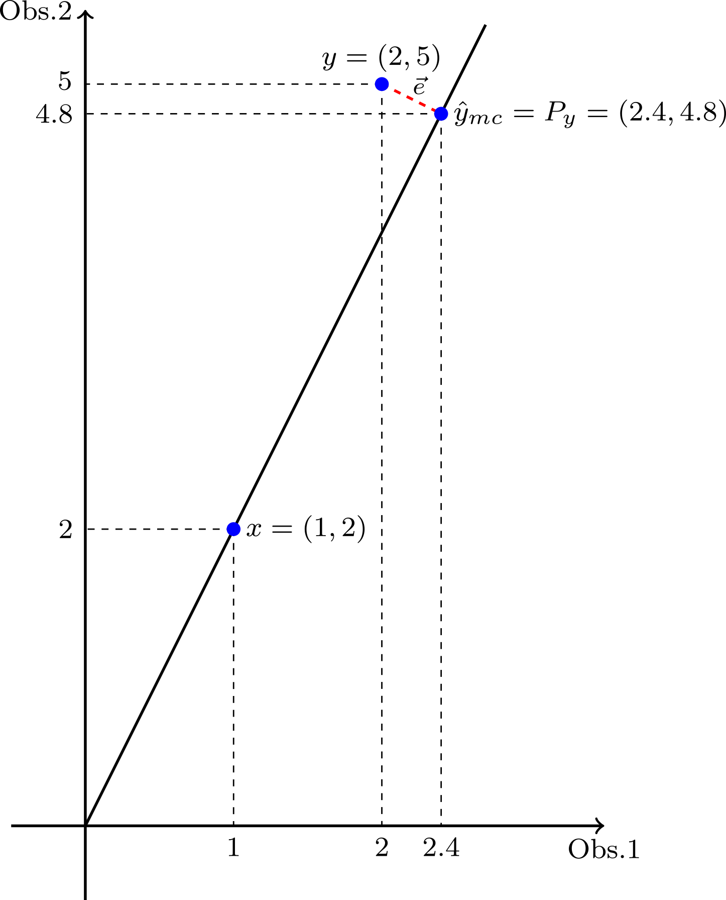

24. En el caso del MCO usemos la distancia euclidiana: hay que trazar una perpendicular a la recta que pasa por Y. Es la proyección ortogonal. En este ejemplo eso da Ymc = (2,4, 4,8). El vector de errores es 
e=(2-2.4, 5-4,8)=(-0,4, 0,2). El beta es 2,4 ya que 2,4 * (1, 2) = (2,4, 4,8)

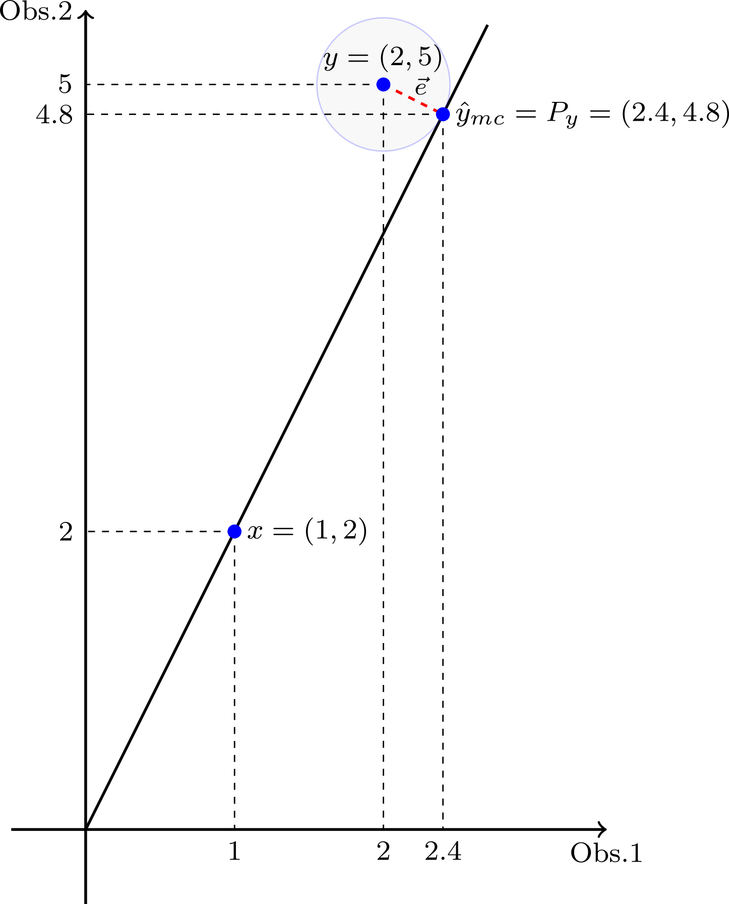

25. No casualmente, el vector de errores es perpendicular a la recta: el producto interior, calculado como la suma de los productos componente a componente, se anula (-0,4 * 2.4)  + (0,2 * 4,8) = 0.

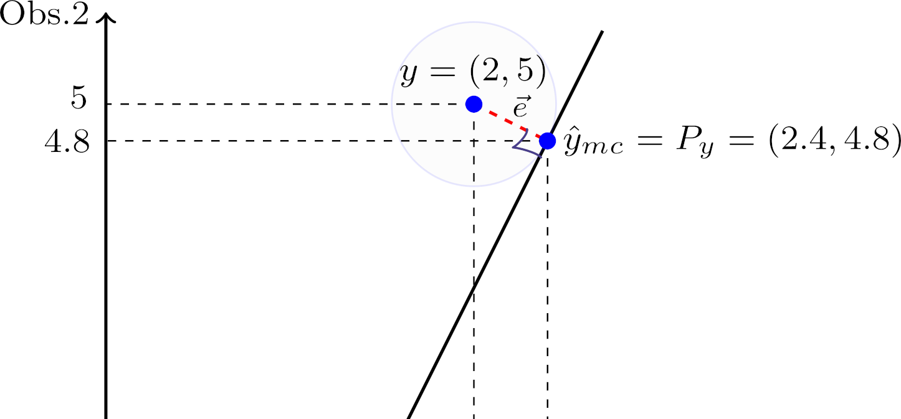

26. En cambio el MAD usa la distancia mahattan. La estimación y el beta se encuentran usando el rombo tangente en lugar del círculo. El error ya no es ortogonal a la recta.

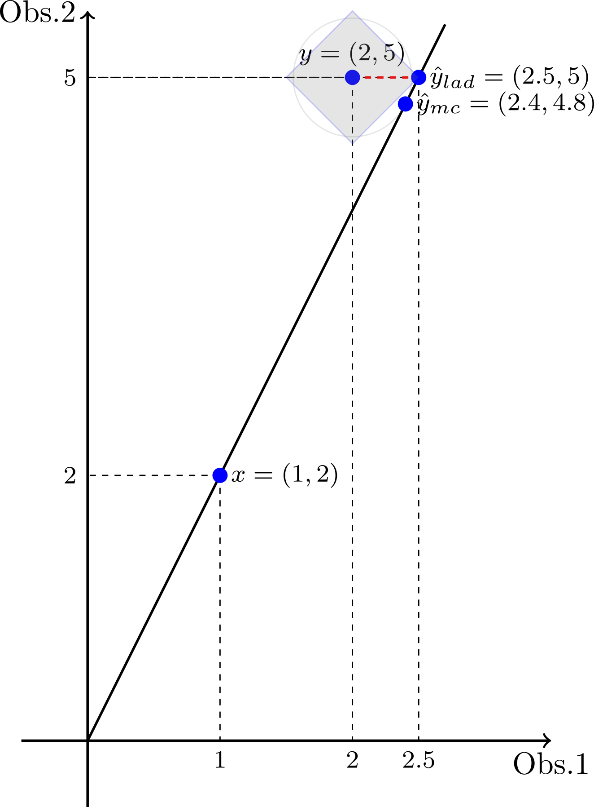

27. En suma, ambos métodos implican geometrías diferentes. Aunque el MCO parece más "raro", se empareja en realidad con nuestra noción cotidiana de distancia (el viejo Pitágoras). Y este espacio permite definir nociones clave como la de proyección ortogonal, ausentes con la Manhattan

28. Con más observaciones y regresores se hace imposible hacer una representación visual sencilla . Sin embargo, la interpretación geométrica sigue siendo la misma. Por eso el operador para estimar con el MCO se llama "matriz de proyección" 

$\hat{y}=X\hat\beta = X(X^tX)^{-1}X^ty=Py$

donde $P$ es la *matriz de proyección* 
de $y$ en el espacio generado por $X$.

29. Esta interpretación se puede extender de espacios de vectores de datos (el MCO más elemental) a variables aleatorias. En dicho caso hay que pensar en espacios de funciones (las variables aleatorias son funciones medibles), pero *maravillosamente* la geometría es la misma.

30. Los espacios euclidianos pasan a ser espacios de Hilbert (con norma L2) y la distancia Manhattan a espacios de Banach (con norma L1). Los espacios de Hilbert mandentrán su ventaja en simplicidad sobre los demás porque tienen producto interior, ángulos y proyecciones ortogonales 

31. Bonus track: la geometría de los espacios de Hilbert unifica campos de estudio tan diversos como la i) probabilidad, la estadística y la econometría (la proyección ortogonal es la base para definir la varianza, la covarianza/correlación, la esperanza condicional, etc.)

32. ii) La física cuántica (los estados cuánticos son elementos de un espacio de Hilbert y las amplitudes de probabilidad de transicionar de un estado a otro están dadas por el producto interno entre ambos)

33. iii) El análisis espectral (análisis de Fourier) de una onda (o de un proceso estocástico) también es la proyección de una función sobre la "base" formada por las exponenciales complejas (o sobre senos y cosenos).