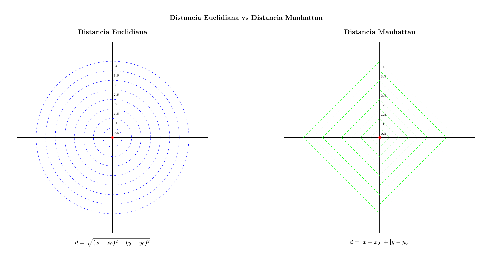
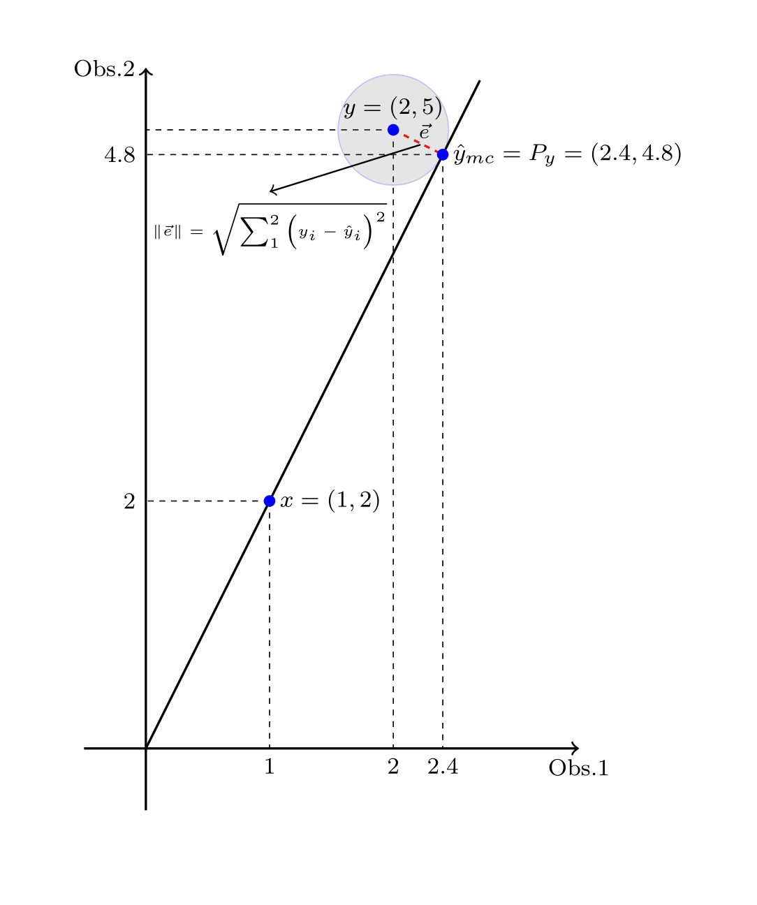
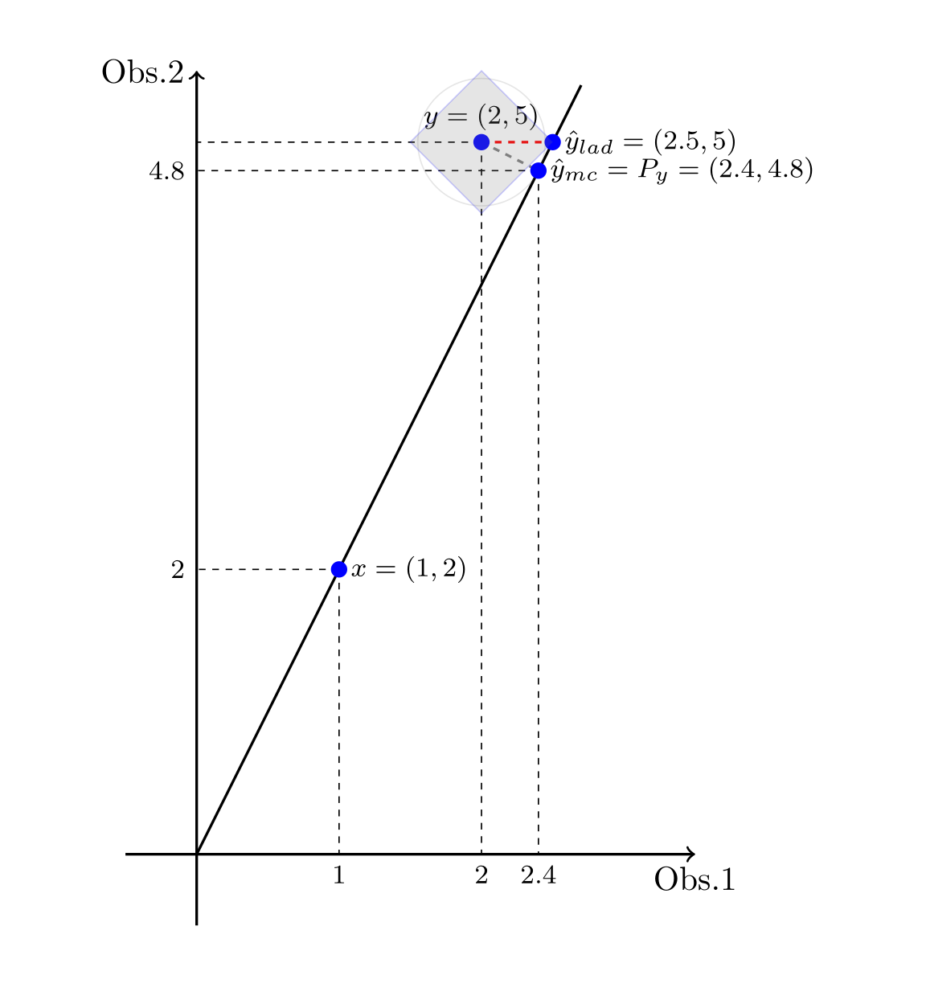

# Un par de aspectos sobre la geometría de los mínimos cuadrados

1. Siempre me extrañó que la primera opción para los modelos de regresión fuese minimizar errores cuadráticos y no los absolutos. Hay muchos (y muy sofisticados) motivos, pero el que más me atrapa es que los primeros viven en el mundo de la geometría euclidiana: el mundo pitagórico

2. El método de mínimos cuadrados ordinarios (MCO) es 

$y = \hat{y} + \hat{e} = x\beta + \hat{e}$ 

con un $\beta$ que minimiza  

$\lvert\lvert\hat{e}\rvert\rvert_{mc}=\sum_{i=1}^{n}\hat{e_i}^2=\sum_{i=1}^{n}(y_i-\hat{y}_i)^2=\sum_{i=1}^{n}(y_i-x_i\beta)^2$

3. ¿Por qué no minimizar las desviaciones absolutas, como en el método de Mínimas Desviaciones Absolutas (LAD)? 

 $\lvert\lvert\hat{e}\rvert\rvert_{lad}=\sum_{i=1}^{n}\lvert\hat{e_i}\rvert=\sum_{i=1}^{n}\lvert y_i-\hat{y}_i\rvert$

3. Hay muchos motivos, muchos de gran profundidad teórica. Pero en términos geométricos hay insights muy lindos para tener en cuenta, y que no siempre resultan simples de visualizar

eee

eee

eee

